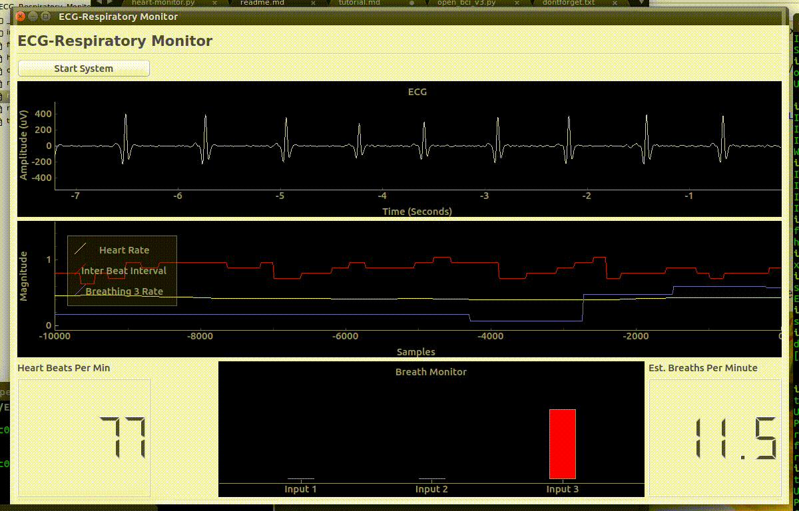
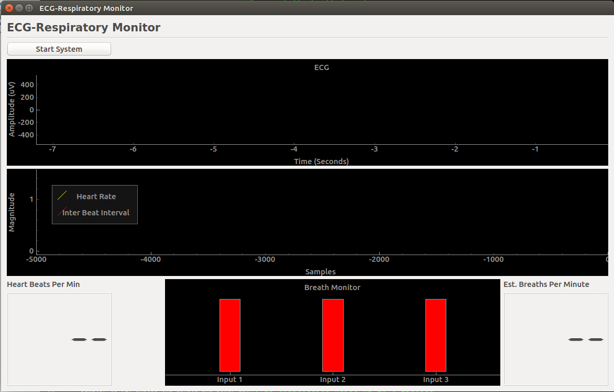
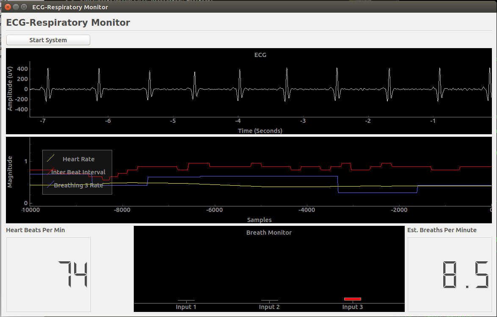

ECG_Respiratory Monitor
======================

ECG Respiratory Monitor allows you to view and analyze several aspects of ECG and respiratory data in real-time. 

This application is designed to work with the OpenBCI 32bit Board. The board must have [OpenBCI_32Bit_Analog-Sensor](https://github.com/OpenBCI/OpenBCI_32Bit_Analog-Sensor) firmware uploaded, in order to include up to three channels of respiratory data inputs.

## Contents
* [Setup](#setup)
* [Usage](#usage)

# Setup

1. Download the [ECG_Respiratory_Monitor](https://github.com/gabrielibagon/ECG_Respiratory_Monitor) repository from Github.
2. Navigate to this folder using your command line/terminal
3. Install dependencies
	In Terminal, type:

	`pip install -r requirements.txt`

	If you do not have `pip` installed, first type `sudo easy-install pip` and then try to command again.

Your program should be set up to run.

# Usage

## Running the program

1. Enter the following into terminal:

	`python heart_monitor.py` 

	After a moment, you should see a GUI appear:

	

2. Power on your board, and plug in your dongle.

3. Press "Start System" in order to begin monitoring your data. If all is set up correctly, you should be able to begin monitoring your ECG and respiratory inputs. If there are any errors, please see [Troubleshooting](#troubleshooting)

	

#Troubleshooting
1. ** After pressing "Start System" : "UnicodeDecodeError: 'utf-8' codec can't decode byte 0xc0 in position 0: invalid start byte"**

	This is another known issue with the serial port parser. If you get this error, simply unplug the dongle and power down the board, and then reconnect the dongle and power the board back up (this order works most consistently). Try pressing "Start System" again.

2. ** After pressing "Start System": "OSError: Cannot find OpenBCI port"**

	Similar to #1, unplug the dongle and power down the board, then reconnect the dongle and turn the board on.